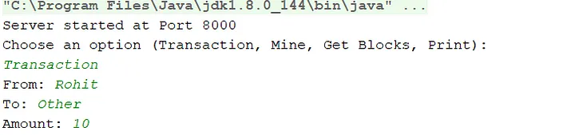
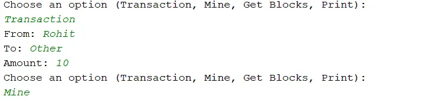
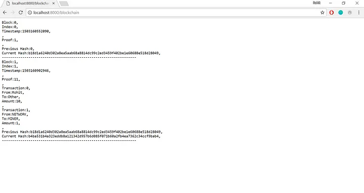

### ***NOTE: This is archived from an old Medium post. The formatting might be different and some images/code blocks may not be complete. [Here is the link to the Medium Article](https://medium.com/@rthotakura97/https-medium-com-rthotakura97-how-i-created-my-own-mini-blockchain-e9c899c40b58).***

This past summer, I became extremely interested in the concept of the **blockchain**, the underlying technology behind cryptocurrencies. Blockchain technology is growing, and its spilling into different industries. The ways that the blockchain can impact society, economics, and politics is unforeseen and is inching closer and closer.

As an avid fan of blockchain technology, I decided to build my very own version of a blockchain that trades a fake currency. After a couple of weeks, I was able to run a full, working node of a simple, self-deployed blockchain. I am writing this article to share my experiences on what I did and how I did it.

In a way, this is also a guide for those who want to get into blockchain development. All of my work was created through observations of blockchain concepts, and studying the Bitcoin core [code](https://github.com/bitcoin/bitcoin).

For those who might still be unfamiliar or completely lost about blockchain technology, [here](https://hackernoon.com/wtf-is-the-blockchain-1da89ba19348) is a really cool and interactive article explaining it!

The source code is available in [this](https://github.com/rthotakura97/mini-blockchain) Github repository.

Shoutout to [Hans Kamin](https://medium.com/u/6ab05a8a2a7c?source=post_page-----e9c899c40b58--------------------------------) for inspiring me to write this post.

The Blockchain Rundown
======================

Here are the major characteristics of the standard blockchain:

*   **Security**
*   **Block mining**
*   **Consensus**
*   **Decentralization**

My implementation contains all of these defining traits. But first, we need to go through the basic structures of the blockchain.

The Basics
==========

The “Block” Structure
---------------------

“Blockchain” sounds pretty self-intuitive. It is a long chain of “blocks” that contain information. I wanted to trade a fake currency, so the information in my blocks is “transactions” between people. For simplicity, each block only has one transaction. Here is the structure for a block:

Structure for each “Block”

```
public class Block {

    /*Class variables, all the attributes of the block*/
    private int index;
    private long timestamp;
    private Data data;
    private String prev_hash;
    private String self_hash;

    /*Constructor, builds a block with passed in variables, then creates a hash for curr block*/
    public Block(int index, long timestamp, Data data, String prev_hash){

        /*Set local attributes*/
        this.index = index;
        this.timestamp = timestamp;
        this.data = data;
        this.prev_hash = prev_hash;

        /*Create hash for current block*/
        this.self_hash = hashBlock();
    }
```

Each `Block` has an `index`  (the location in the chain), a `timestamp`  (the time at the creation of the block), a `Data`  field, a hash pointer for the previous block, and a hash for the current block.

```
/*Represents "data" field of a block --> proof, transactions*/
public class Data {

    /*Class variables*/
    private List<Transaction> transactions;
    private int proofId;
```

The `Data`  field is the core part of the `Block`, as it contains the main transaction of the block and the `proofId`, which is something I will get into when we talk about block mining.

If you look at the bottom of the constructor, you can see that I use a function called `_hash_block_` to create the current hash. This is part of the security protocol of the blockchain, which I will also explain soon.

The “Blockchain” Structure
--------------------------

As stated earlier, each `Block` is part of a long chain called the “blockchain”_._ Here is my structure for my blockchain:

```
/*Represents the blockchain*/
public class Blockchain {

    /*Blockchain clas variable*/
    private List<Block> blockchain;

    /*Constructor, takes in genesis block data to start the blockchain*/
    public Blockchain(int index, long timestamp, Data data, String prev_hash){

        /*Inititalizes blockchain and adds genesis block*/
        blockchain = new ArrayList<Block>();
        blockchain.add(new Block(index, timestamp, data, prev_hash));

    }
```

The `Blockchain` class is simple. It contains an ArrayList of `Block` objects.

If you look at the constructor, you notice that the initialization of the blockchain takes in the parameters for a `Block`. This is because the **genesis block** (the first block) is created in the initialization. The genesis block is different because it does not hold any data, but instead serves as a reference point for the beginning of the blockchain.

Mini-Recap
----------

That’s it for the basics! The concept is pretty simple: creating a long, chained structure of blocks with information in them. These are represented by my `Blockchain` and `Block` objects. The beauty of blockchain technology is extracted with how it manipulates this chain, which is what I will get into next.

Security
========

One of the biggest characteristics of the blockchain is that it is secure and safe from hackers. For a hacker to change information in the blockchain, he would need something called **51% mining power** to validate his or her part of the blockchain, which is nearly impossible. This would mean that his processing power would need to take up 51% of the entire processing power in the blockhain mining pool. On top of this, the blockchain uses encryption to protect its information and validate the chain periodically.

SHA-256 Hashing
---------------

In my implementation, I use hash pointers to connect blocks. I also create hashes that are unique to each block by filing the block information into a hash function.

```
/*Assigns a SHA-256 hash for the current block by combining all data 
        --> index,timestamp,transactions,previous hash*/
    private String hashBlock(){

        /*Build string to be hashed*/
        String hash = Integer.toString(this.index) + Long.toString(this.timestamp) 
                + hashTransactions() + this.prev_hash;
        /*Send to hash function*/
        hash = hashFunction(hash);
        return hash;
    }

 /*SHA-256 hash function takes in a string and outputs a 256 bit hash*/
    private String hashFunction(String toHash){

        String hashed = Hashing.sha256()
                .hashString(toHash, Charsets.UTF_8)
                .toString();
        return hashed;
    }
```

Every time I create a `Block`, I run the block credentials (`index`, `timestamp`, `transactions`, previous hash) through a **SHA-256 hash function**. The output is a irreversible, 256 byte hash.

How does the hashing relate to the security of the blockchain overall? Earlier I said that every single other item in the block is included in the hash function. If an attacker tries to change even a single bit of the information in this block, the entire hash changes to a completely new 256 byte value. This is the beauty of hashing, and especially SHA-256 hashing.

Below is the chain validation algorithm:

```
/*Validates each block in the chain looking for any hash pointer descrepancies, which can point to a tampering problem*/
    public boolean validateChain(){

        /*Loop through chain and check hash pointers, inconsistencies means block was tampered w/*/
        for(int i=0; i<blockchain.size()-1; i++){

            /*Get current hash and the next blocks prev hash and compare*/
            String currHash = blockchain.get(i).getSelf_hash();
            String nextHash = blockchain.get(i+1).getPrev_hash();
            if(!(currHash.equals(nextHash)))
                return false;
        }

        return true;
    }
```

If an attacker changes the information in a block, the `prev_hash`  of the next block and the `self_hash` of the current block will not match up, invalidating the chain. Therefore, a single chain by an attacker to the blockchain will register that entire chain invalid and the node will have to reach to other nodes to get a validated blockchain.

Mini-recap
----------

We have seen how the blockchain is secured in two ways. One way being the nearly unreachable “51% mining power”, and the second way being encryption. Since an attacker most likely will not have the money or the infrastructure to own the processing power of the majority of the total blockchain pool’s processing power, the only other option is block manipulation. But with hashing, any change in a block invalidates the chain and sends the node to look for a new, validated chain.

Block Mining
============

Blocks are added to a blockchain after they are “mined”, meaning the prospective block is validated and there is proof that some computational power was exerted on the block. In my implementation, when a node chooses to mine the latest transaction, the `begin_mine` function is called and the node goes through a **proof of work** algorithm, then creates the block.

`Proof of Work & proofId`
-------------------------

When a block is mined, it needs to go through an algorithm (called a **proof of work**) that proves that there was some computational power involved in the process. Before the block is even created, I run the node through my own, simple `proofOfWork` algorithm:

```
 /*Simple proof of work algorithm to prove cpu usage was used to mine block*/
    public int proofOfWork(){

        /*Proof of work --> simple arithmetic --> find number that is divisible by both lastProof and 11*/
        int lastProof = blockchain.get(blockchain.size()-1).getData().getProofId();
        int incrementor = lastProof + 1;
        int divisor = 11;

        while (!(incrementor % lastProof == 0 && incrementor % divisor == 0)){
            incrementor++;
        }

        return incrementor;
    }
```

This algorithm is very simple. It finds a number (the `incrementor`) that is divisible by 11 and the last block’s `proofId`.

So what is the `proofId`? It is just an integer that represents the outcome (`return incrementor;`)of the `proofOfWork` algorithm. It is the proof that this algorithm was executed and finished, confirming that there was processing power involved. For those who are familiar with the blockchain, it represents the **nonce** of each block.

Mining
------

In my implementation, an unclaimed transaction on the server can be mined by any of the nodes. Once the node is finished mining the new block, it adds the new block to its own local blockchain. Here is the whole mining process:

```
/*Mines the transaction and creates the block to add to the blockchain*/
    public boolean beginMine(Transaction transactionHistory){

        /*Make sure block is valid, or return false*/
        if(transactionHistory.getAmount().equals("0") || transactionHistory.getAmount().equals("none")) {
            System.out.println("Mine Unsuccesful");
            return false;
        }

        /*Proof of work function*/
        int proof = proofOfWork();

        /*Make transactions for the original transaction and the reward for mining the block*/
        Transaction newTrans = new Transaction("NETWORK", "MINER", "1");
        List<Transaction> transactions = new ArrayList<Transaction>();
        transactions.add(transactionHistory);
        transactions.add(newTrans);

        /*Create data for the new block*/
        Data newDataBlock = new Data(proof, transactions);

        /*Create new block*/
        Block prospectiveBlock = makeProspectiveBlock(blockchain.get(blockchain.size()-1), newDataBlock);

        /*Add to blockchain*/
        blockchain.add(prospectiveBlock);
        return true;
    }
```

The method starts off by making sure that the genesis block is not mined, and that an invalid amount is not mined. Then it goes through the `proofOfWork` algorithm as shown above to obtain a `proofId`. Once this is finished, a new `Transaction` is created to reward the miner with 1 unit of the fake currency. This is the incentive that the actual blockchain uses to keep a large mining base. From here, a new `prospectiveBlock` is created, and then eventually added to node’s local blockchain.

Mini-recap
----------

Block mining is pretty cool, and in my case relatively simpler than the actual mining algorithms used in Bitcoin. Every unclaimed transaction can be mined by putting it through a process called the **proof of work**, then rewarding the miner and creating a block that is added to the node’s local blockchain.

Consensus
=========

One big questions that people have about the blockchain is how each node in the network makes sure it has the same chain as every other node in the network (remember that the blockchain is decentralized). It is very easy to have discrepancies between nodes because only individual nodes mine blocks. This is solved through a **consensus protocol**, which is a way to make sure that every node has the same blockchain as every other node.

When a block is mined by a node, the block is added to the node’s local blockchain. However, this block is not added to any other nodes’ blockchains. In order to update the blockchain throughout the network, the node which mined the block has to relay its addition to the blockchain throughout the network. In my implementation, I relay the new blockchain by sending it to the HTTP server for the other nodes to see. Here is my consensus protocol:


```
/*Get latest blockchain from server for comparison*/
Blockchain latestChain = HTTPServer.getServerBlockchain("http://localhost:8000/blockchain");
/*If latest blockchain is longer, replace own local blockchain*/
if(latestChain.getBlockchain().size() > blockchain.getBlockchain().size()){
       blockchain = latestChain;
}
```

This protocol is very simple. To get the latest blockchain, the node retrieves it from the server and compares the lengths of the server blockchain and its own blockchain. The general rule is that the longer blockchain wins (this also follows the exact protocol that cryptocurrencies use). So if the local blockchain is longer, the node keeps it. However, if the latest blockchain posted to the server is longer, the node adopts the server blockchain as its own.

Mini-recap
----------

Consensus is important because it keeps the blockchains in each node throughout the network consistent. The protocol is very simple: compare the lengths of the local blockchain and the server blockchain, and keep the longer one. The longer chain is always more important because it accounts for more transactions that could otherwise be erased if a shorter blockchain is used.

Decentralization
================

Another aspect of the blockchain is that it is completely decentralized. This means that every node in the network has its own version of a blockchain. This is different than having a centralized blockchain which all the nodes reference. This is how I achieved decentralization:

I used a local HTTP server for my blockchain implementation at “localhost:8000”. I had two endpoints: “**/transactions”**, and “**/blockchain**”.

/transactions
-------------

Whenever a node makes a transaction, the information is relayed to the HTTP server at “localhost:8000/transactions”. Once it is on the server, any other node can pick it up and mine it.

/blockchain
-----------

What really makes this implementation decentralized is that every node has its own local blockchain. The biggest question is how the local blockchain of each node stays consistent with the local blockchains of other nodes.

When a block is mined and added to a node’s local blockchain. The node relays its blockchain to rest of the nodes by posting it on the server. The other nodes then adopt this new blockchain if they need to. This way, every node has a blockchain that is consistent with that of the other nodes. The key part to remember is that every node has its **OWN** blockchain. The blockchain on the server does not always have to represent the general consensus for what the blockchain looks like.

I would have usually shown you some code by this point, but since decentralization was achieved through setting up an HTTP server, most of the code is just Java network programming. If you want to see the code for the networking, click [here](https://github.com/rthotakura97/mini-blockchain).

How It Works
============

Let’s take a look at some quick usage of my blockchain implementation. Everything can be done right from the Java program.

There are four things you can do:

*   Make a transaction
*   Mine a block
*   Get the latest blockchain
*   Print the local blockchain

Let’s go through a quick example where we make a transaction and mine the block ourselves.

Making a Transaction
--------------------

A transaction is quite straightforward. You select “transaction” and then enter in the details. This transaction is then relayed to the server for any node to retrieve and mine a block.



Once a block retrieves this transaction and mines a block, the transaction is taken off the server to prevent double-mining.

Mining the Block
----------------

Now the transaction is up on the server and waiting to be mined by a node. So let’s mine the transaction and create a new block to add to the blockchain.



From the program, selecting “mine” will successfully mine the block unless it gives you an error message. By the end of a successful mine, the transaction is validated, the proof of work is executed, the block is created and added to the local blockchain, and the local blockchain is pushed to the server as the latest, up-to-date blockchain. Here is what you see on the “/blockchain” on the local server after the mine:



You can see the genesis block as the first block and the block we just mined as the second block. The second block has all the transaction data and bookkeeping information of the latest transaction. Now any other nodes on the network will look to this blockchain and adopt it if it is longer than their own local blockchain.

Getting the Latest Blockchain
-----------------------------

If you choose to “get blocks”, the program retrieves the latest blockchain from the server and goes through the consensus protocol mentioned earlier.

Printing the Blockchain
-----------------------

If you choose to “print”, the program prints the node’s local blockchain.

Improvements
============

My implementation follows all of the core concepts of blockchain technology. However, it is still relatively simplified compared to actual, real-life blockchain systems. Here are some places I can make improvements in my implementation:

Efficiency
----------

My blockchain only takes one transaction per block. This was done for simplicity but will not scale for real-world applications. This was a recent problem with Bitcoin, which increased its block size for more transactions in a process called **“SEGWIT”**. Adding more transactions per block would decrease the chain size and fit more data into one block. Adding more transactions per block is not a big problem because they can all be hashed with something called a **merkle tree**, which acts as another hash-pointer security protocol to validate transactions within a block.

Simplicity
----------

At some times, the simple nature of my implementation causes a few roadblocks. As mentioned before, the inefficiency caused by having only one transaction per block is derived from the simplicity of this model.

Another example is that a transaction can be completely overwritten and erased if it is not mined in time. If another transaction comes along, it overwrites any transactions under it, whether they are mined are not. To fix this, I can queue up the transactions that are sent to server and have individual nodes take the transactions off as they are mined.

The last problem comes with race conditions in the code. Let’s say that two nodes both mine a block simultaneously and attempt to post their latest blockchain at the same time (or within a short time of each other). This will lead to a problem where other nodes do not know which blockchain to adopt. Once again, this can be fixed with a queue system.

Server
------

Right now, this blockchain runs on port 8000 of the local host. This limits the ability to scale the number of nodes and have other people interact with it on the network. I hope to migrate this blockchain to an actual server so that it feels more like a peer-to-peer network.

Recap
=====

Blockchain technology can solve a lot of problems that are apparent in the real-world today. Outside of cryptocurrencies, more and more companies are starting to utilize it for its applications in databases, all the way to supply chain management. As a fan of decentralization, I see blockchain as the perfect tool to mitigate differences in power for processes that should hold all parties equal.

I will continue to build on this project in the future by doing the following:

*   **Implement smart contracts**
*   **Migrate to a real server**
*   **Improve scaling efficiency**

If any of you readers have any more ideas, don’t hesitate to reply in a comment or to contact me!

**For all of the source code, you can check out the Github repository** [**here**](https://github.com/rthotakura97/mini-blockchain)**.**
